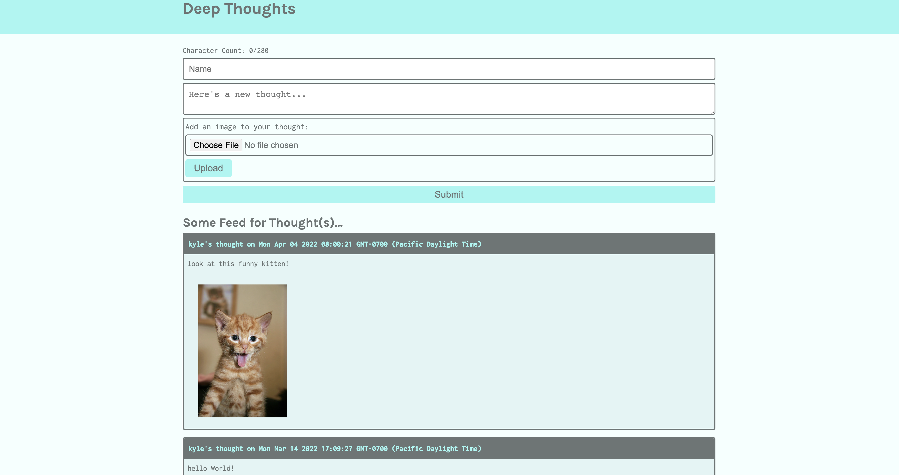

# AWS-Thought

 ## Table of contents
* [Installation](#installation)
* [Usage](#usage)
* [Credits](#credits)
* [License](#license)

---
## Description

  This aplication is a social media style platform that allows users to share their thoughts and pictures. It is built using AWS cloud serves to store info with DynamoDB. Full AWS deployment to come at a later date

  

## Installation
  Download the repository to your local storage, then using npm start in the Server and Client folders in order to access both. 

  ### Have any questions or concerns? Contact me!
https://github.com/KyleKilmartin371/aws-thought

kylekilmartin371@gmail.com

  ---
### License
  https://opensource.org/licenses/MIT
